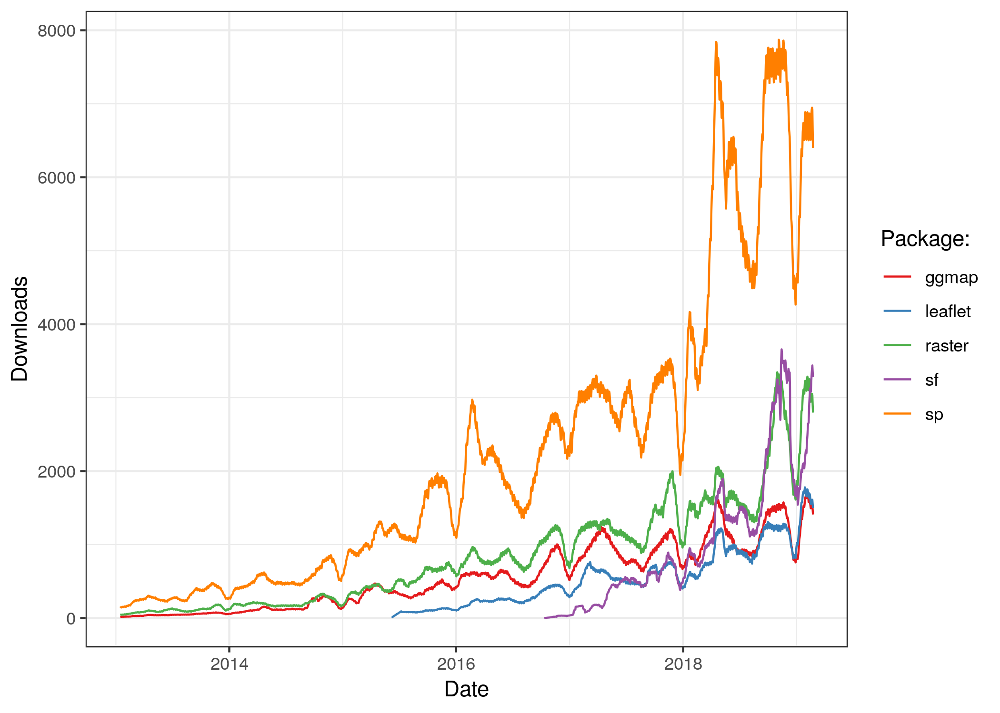

```{r setup, include=FALSE}
knitr::opts_chunk$set(echo = TRUE)
```

## Cosas que debo tener muy en cuenta

- Librería específicas para análisis espacial son variadas

- Es necesario conocer muy bien la naturaleza del objeto a analizar (línea, polígono, punto, raster, stack)

- Trabajar bajo un mismo sistema de proyección

## ¿Qué cosas puedo hacer?

- Visualizar

- Reproyectar

- Cortar 

- Hacer subset

- Interpolar

- etc.

## ¿Cuál es la utilidad versus hacerlo en un GIS tradicional?

- Permite automatizar el proceso completo (desde los datos brutos hasta una gráfica final)

- Permite hacer análisis reproducible

- Dependiendo del proceso (y del programador), es mucho más rápido

- Permite evaluar diferentes opciones y escenarios de forma fácil

## Librerías más utilizadas


## Qué aprenderé hoy

- 1.1 Cargar rasters y vectores

- 1.2 Cargar puntos desde un dataframe

- 2 Hacer cortes y máscaras

- 3 Transformar de raster a tabla y asignar atributos desde polígonos

- 4 Interpolar valores desde puntos y transformalo en ráster
